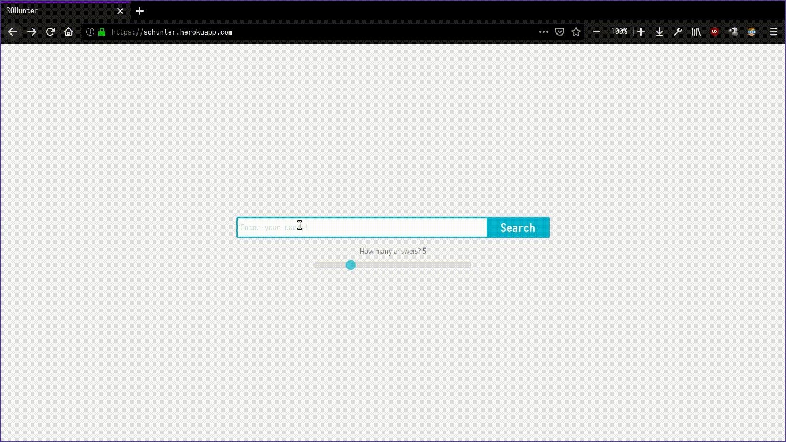

# SOHunter

SOHunter aims to serve you the best answers from Stack Overflow, using NLP (with [NLTK](http://www.nltk.org/)) and the Stack Exchange API (with [Py-stackexchange](https://github.com/lucjon/Py-StackExchange)).

This was created as an entry for the [IBM Hack Challenge](https://www.ibm.com/in-en/university/academia-programs/events/ibm-hack-challenge/?parent=events) 2019.

**All the files for the challenge (Undertaking, Ideation, presentation, and demo video) are inside the _submission\_docs folder_.**

## Features

* Allows you to quickly get the top k answers to any query.
* Simple, unobstrusive UI implemented with Flask, HTML, and vanilla CSS and JS.
* Lets you know how confident it is of an answer with with the color of the border (the redder the border, the lesser the confidence).

## Instructions to Run

Try the online version [here](https://sohunter.herokuapp.com).

To run the app locally, you need to first clone this repository with:

    $ git clone https://github.com/data-spartans/ibmhack2019_soquery

or download it as a zip.

Once in the repository directory, install the required python packages with:

    $ pip3 install -r requirements.txt

The NLTK packages required are listed in nltk.txt. They will be downloaded and setup automatically when you first run the app, but you can download them manually by running the following on a terminal:

    $ python3
    
    >>> import nltk
    >>> nltk.download()

and then selecting the required packages in the GUI.

Finally, you need to create a file named `config.py` containing this line:
    
    API_KEY = None

If you have a StackExchange API key, you can specify that (as a string) instead of `None`. 

Run the app with:

    $ python3 app.py

and access it on a browser at `localhost:5000`

Additionally, you can try it out on the command line with:

    $ python3 cli.py

## Team

* [Aditya Kumar](https://github.com/coderford)
* [Hitesh Varma P.](https://github.com/HiteshVarma007)
* [Rohan Banerjee](https://github.com/Rohan-Banerjee)

## Thanks

This project is possible because of the following pre-existing projects and their contributors:

* [Py-stackexchange](https://github.com/lucjon/Py-StackExchange)
* [NLTK](http://www.nltk.org/)
* [Flask](https://palletsprojects.com/p/flask/)
* [Requests](https://2.python-requests.org/en/master/)
* [HTML2text](https://github.com/Alir3z4/html2text/)
* [Gunicorn](https://gunicorn.org/)
